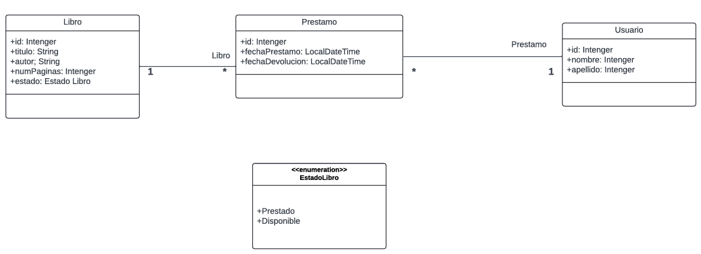
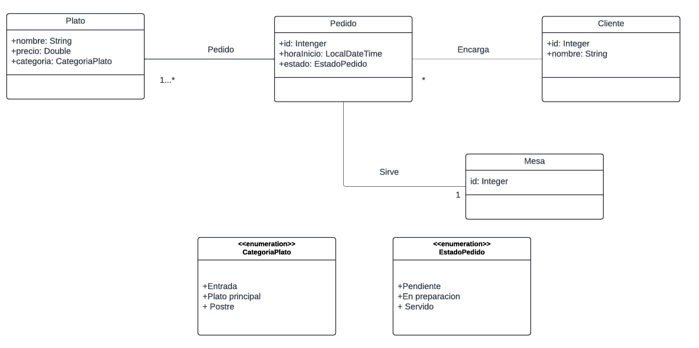
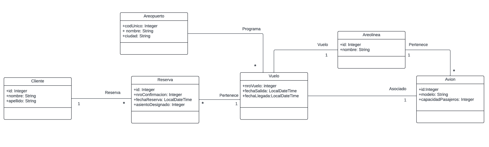

# Universidad Nacional de Misiones   
# Facultad de Ciencias Exactas, Químicas y Naturales
 
## **Trabajo Práctico 1**: Practica de UML Programación Orientada a Objetos II  
**Alumno:** Rapp Luis  
**Año:** 2024  

--- 

### Sistema Biblioteca
  

---  

### Sistema de Gestión de Pedidos de Restaurante
  

---  

### Sistema de Reservas de Vuelos

